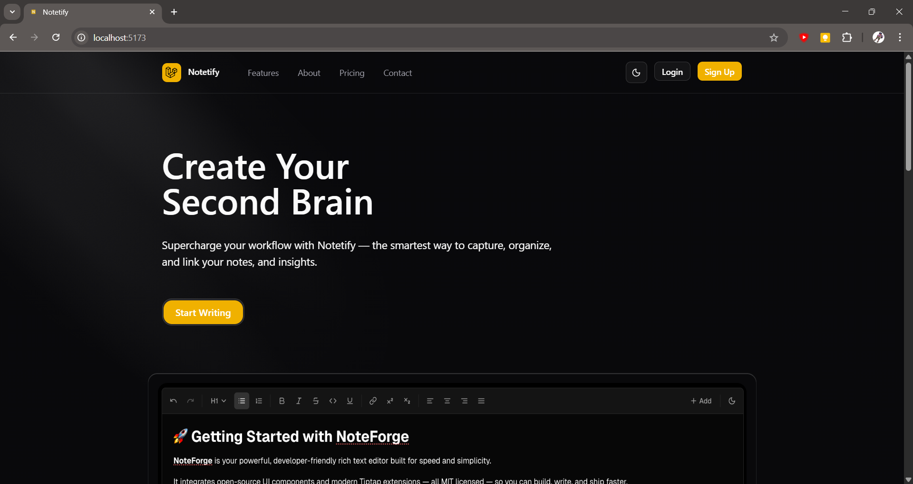
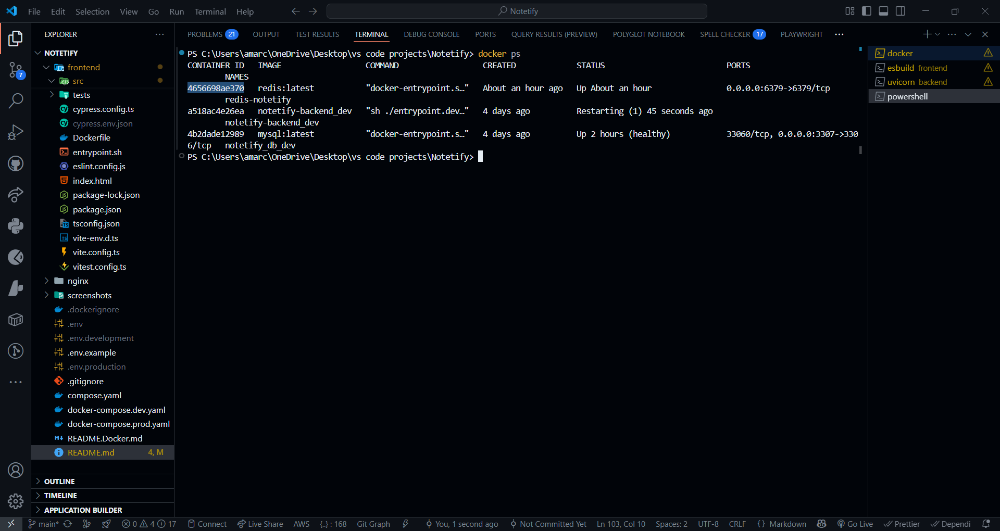
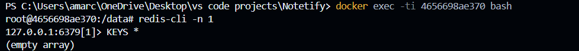

# Notetify

Notetify is a sleek and modern full-stack document editing note-taking application inspired by Google Docs and Evernote, designed to help you easily organize your thoughts, tasks, and plans.

It supports tagging,  pinning, and favoriting notes, along with powerful real-time collaboration features that allow users to share and work together on documents simultaneously. Users are also able to upload different medias and reference and preview them within there notes.

Built with a React frontend and a Laravel backend.

---

## Features

* Create and manage notes with ease
* Pin important notes for quick access
* Use custom tags to categorize notes
* delete notes when no longer needed
* Modern UI with dark theme for comfort
* Real-time collaboration: Share notes and notebooks and collaborate in real-time
* Upload files ,documents and other medias and reference and preview them in your notes

---

## Project Structure

```
Notetify/
├── api/          # PHP Laravel API
├── client/         # React frontend (Vite)
├── compose.yaml      # Docker Compose configuration (optional)
├── .env.example      # Environment variable example
├── README.md         # Project README
```

---

## Prerequisites

Make sure you have the following installed:

* [Node.js (v18+)](https://nodejs.org/) & npm
* [PHP (8.1+)](https://www.php.net/downloads.php)
* [Composer (PHP package manager)](https://getcomposer.org/)
* A local database server (MySQL or PostgreSQL)
* (Optional) [Docker & Docker Compose](https://docs.docker.com/)

---

## How to Clone & Run the Project

### 1. Clone the Repository

```bash
git clone https://github.com/Amarusinggithub/Notetify.git
cd Notetify
```

---

### 2. Setup Backend (Laravel)

```bash
# Navigate to backend directory
cd api

# Install PHP dependencies
composer install

# Copy .env file
cp .env.example .env

# Generate application key
php artisan key:generate
```

Now, update your **`.env`** file with database credentials:

```env
DB_CONNECTION=pqsql
DB_HOST=127.0.0.1
DB_PORT=3306
DB_DATABASE=notetify_db
DB_USERNAME=postgres
DB_PASSWORD=
```

Run migrations:

```bash
php artisan migrate
```

Start the Laravel backend server:

```bash
php artisan serve
```

Backend runs at: **[http://localhost:8000](http://localhost:8000)**

---

### 3. Setup Frontend (React + Vite)

Open a new terminal:

```bash
# Navigate to frontend
cd client

# Install dependencies
npm install

# Start development server
npm run dev
```

Frontend runs at: **[http://localhost:5173](http://localhost:5173)**

---

## Screenshot

A preview of the Notetify UI in action (add screenshot here).

### Landing page View


---

## Environment Variables

* Copy `.env.example` → `.env` in both **backend** and **frontend** directories.
* Update database connection details in `backend/.env`.

---

## Run Redis in Docker

For caching & real-time broadcasting:

```bash
docker run -d --name redis-notetify -p 6379:6379 --rm redis:7-alpine
```

Get container ID:

```bash
docker ps
```




Access Redis container:

```bash
docker exec -it <yourRedisContainerId> sh
```




---

## Run with Docker Compose (Optional)

Build & run all services:

```bash
docker compose up --build
```

For development:

```bash
docker-compose -f docker-compose.dev.yaml up --build
```

For production:

```bash
docker-compose -f docker-compose.prod.yaml up --build
```

